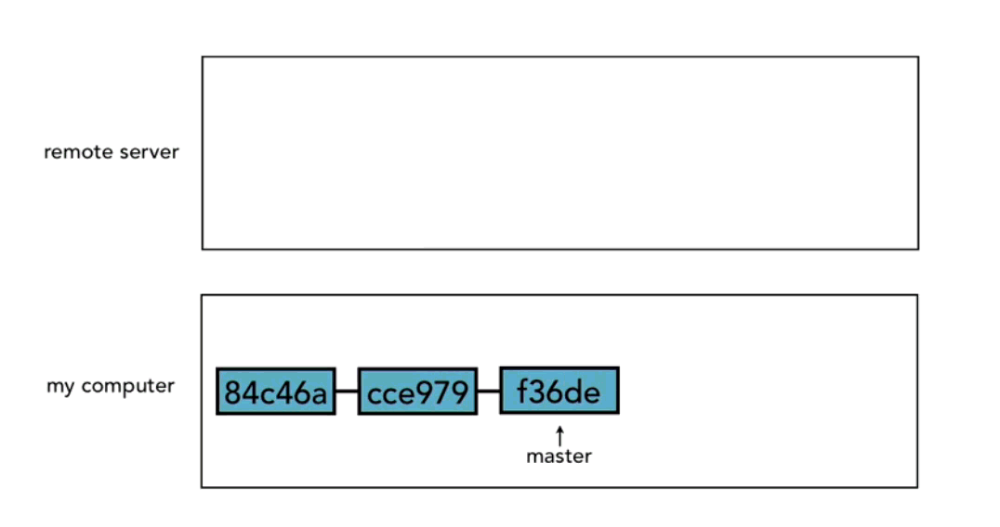
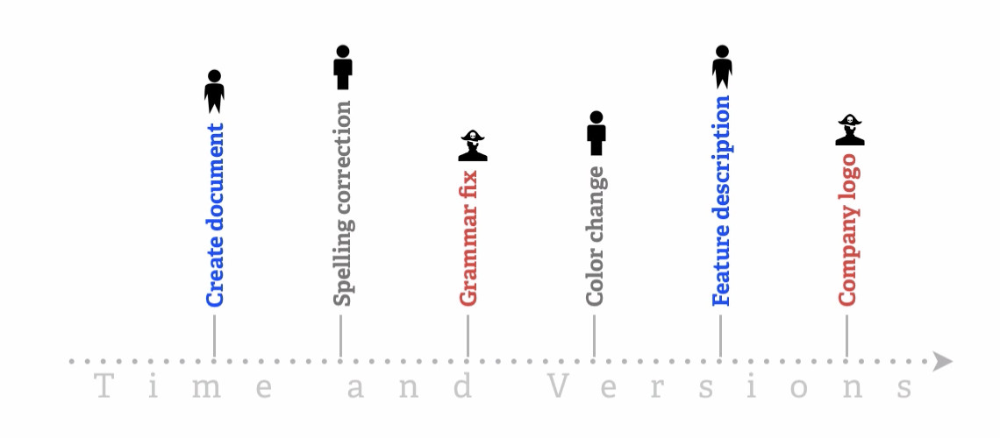
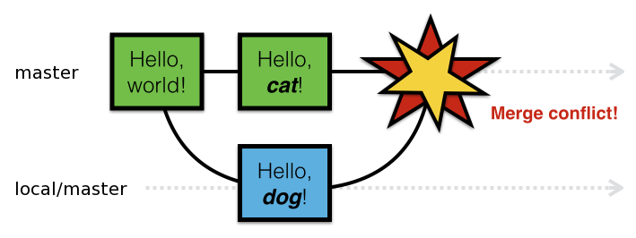
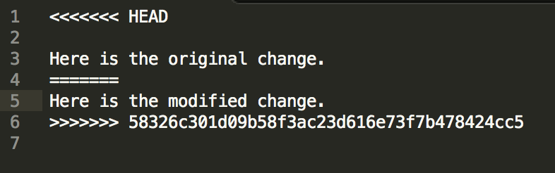
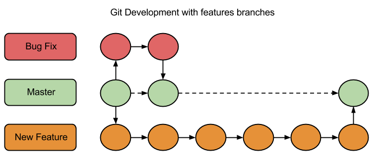
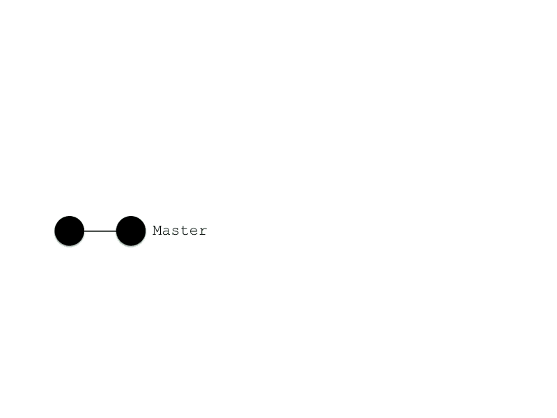
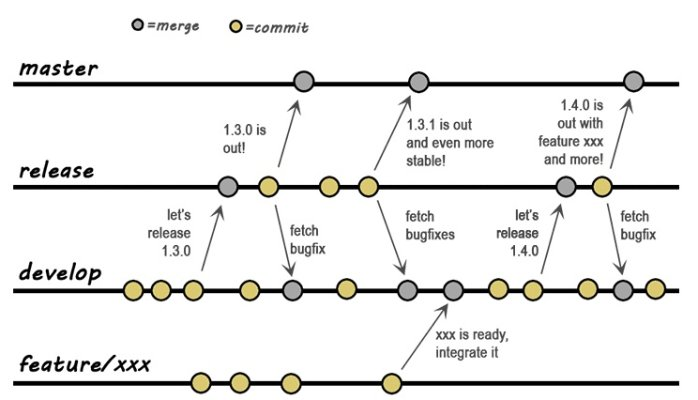
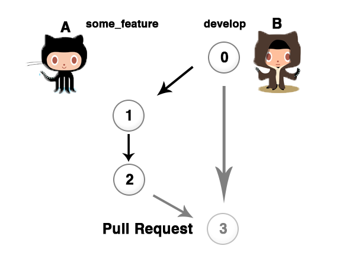
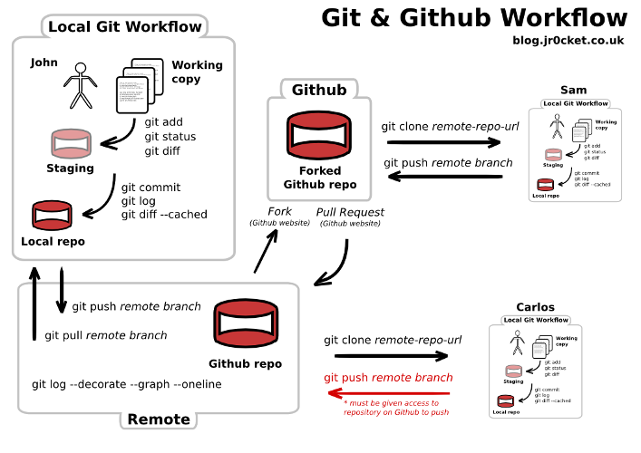
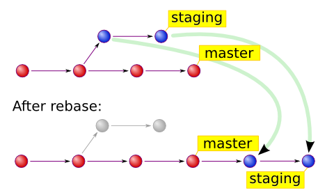

#HSLIDE

## GIT

<span style="color:gray">Sistema de controle de versão</span>

#HSLIDE
### Wikipedia:
>É um VCS (Sistema de controle de versão), monitora mudanças em arquivos e coordena o trabalho neles para um individuo ou um grupo de pessoas, é normalmente usado em desenvolvimento de software, mas também pode ser usado em qualquer tipo de arquivo.

#HSLIDE
### Linus:

>Foi criado por Linus Torvalds em 2005 para uso no desenvolvimento do Kernel do Linux.

#HSLIDE
### Antes dos VCS:
#### Compartilhar código?


#HSLIDE
### Antes dos VCS:
#### Histórico?


#HSLIDE
### G.I.T.:

#### Global Information Tracker
_<span style="color:gray">"Se você estiver de bom humor"</span>_


#### Goddamn idiotic truckload of sh*t":
_<span style="color:gray">"Quando não funciona"</span>_


#HSLIDE

### Motivo do nascimento:

>Um dos principais motivos foi o descontentamento do Linus com as ferramentas diponíveis na época

>_"I decided I could write something better than everything out there in two weeks. And I was right." -Linus Torvalds_

#HSLIDE
### O que existia 2005?
- Perforce
- Monolitico
- CVS
- BitKeeper

#HSLIDE

### O que tinham em comum:
> Além de não serem opensource... (código aberto)

#HSLIDE

### Centralized Repository


#VSLIDE

### As três árvores


>Modified, Staged, Committed

#VSLIDE

### Git add & Git commit


>Modified, Staged, Committed

#VSLIDE

### Linha do Tempo


#VSLIDE

### git log


#HSLIDE

### O objetivo é compartilhar!

```
git push origin master
```

#HSLIDE

### git push



#HSLIDE

### Mas e em grupo...



#HSLIDE

### Conflitos


#HSLIDE

### Resolvendo conflitos


#HSLIDE

### Crie Branches!
```
git branch <nome da branch>
```


#HSLIDE

### Junte tudo
```
git checkout master
git pull
git merge feature
```


#HSLIDE

### Git branches


#HSLIDE

### e na hora de juntar tudo


#HSLIDE

### Fork e Pull request


#HSLIDE
### Contribuindo um projeto opensource


#HSLIDE
### Concluindo
#### .gitignore
```
*.class
*.log

.cache
.history
.lib/
dist/*
target/

PITCHME2.md
```

#HSLIDE
### Concluindo
#### Rebase


#HSLIDE
### Fragment data
- Java
- JavaScript <!-- .element: class="fragment" -->
- Kotlin     <!-- .element: class="fragment" -->
- Go         <!-- .element: class="fragment" -->
- Scala      <!-- .element: class="fragment" -->
