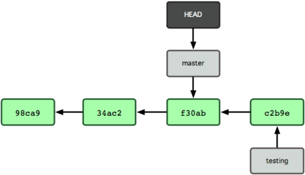

## GIT

>Gerência de Projetos de Software
>Leonardo

---

### Wikipedia:
>É um VCS (Sistema de controle de versão), monitora mudanças em arquivos e coordena o trabalho neles para um individuo ou um grupo de pessoas, é normalmente usado em desenvolvimento de software, mas também pode ser usado em qualquer tipo de arquivo.

---

### Linus:

>Foi criado por Linus Torvalds em 2005 para uso no desenvolvimento do Kernel do Linux.

---

### Antes dos VCS:
#### Compartilhar código?


---

### Antes dos VCS:
#### Histórico?


---

### G.I.T.:

#### Global Information Tracker
_<span style="color:gray">"Se você estiver de bom humor"</span>_


#### Goddamn idiotic truckload of sh*t":
_<span style="color:gray">"Quando não funciona"</span>_

---

### Motivo do nascimento:

>Um dos principais motivos foi o descontentamento do Linus com as ferramentas diponíveis na época

>_"I decided I could write something better than everything out there in two weeks. And I was right." -Linus Torvalds_

---

### O que existia em 2005?
- Perforce
- Monolitico
- CVS
- BitKeeper

---

### O que tinham em comum:
> Além de não serem opensource... (código aberto)

---

### Centralized Repository


+++

### As três árvores


>Modified, Staged, Committed

+++

### Git add & Git commit


>Modified, Staged, Committed

+++

### Linha do Tempo


+++

### git log


---

### Um pouco sobre branch
>Um branch no Git é simplesmente ponteiro móvel para um commit.


+++

### Criando um branch
```
git branch testing
```


+++

### Onde estou?
>Como o git sabe em qual branch eu estou? por outro ponteiro, o HEAD


+++

### Mudando de branch
```
git checkout testing
```


+++

### Commit
```
git add .
git commit -m 'commit em testing'
```


+++

### Voltando a master
```
git checkout master
```


+++

### Commit
```
git add .
git commit -m 'commit na master'
```


---

### O objetivo é compartilhar!

```
git push origin master
```

---

### git push


---

### Mas e em grupo...


---

### Conflitos


---

### Resolvendo conflitos


---

### Junte as branchs
```
git checkout master
git pull
git merge feature
```


---

### Git branches


---

### Mantém organizado e tenta evitar...


---

### Repo restrito


---

### Fork e Pull request


---

### Concluindo
#### .gitignore
```
*.class
*.log

.cache
.history
.lib/
dist/*
target/

PITCHME2.md
```

---

### Concluindo
#### git rebase


---

### Mais informações
* try.github.io/
* Digging deep into git - Youtube
* Linus Torvalds on git at Google talk 2007 - Youtube

---

### git commit -a -m "Fim"

####Obrigado!
